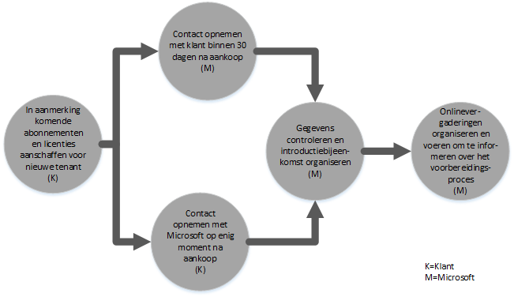

# FastTrack Center Benefit Process voor Azure Active Directory Premium 
Als uw organisatie in aanmerking komt voor FastTrack Center Benefit voor Microsoft Azure AD Premium, kunt u op afstand met Microsoft-specialisten werken aan het gebruiksklaar maken van uw Microsoft Azure AD Premium-omgeving. Zie [FastTrack Center Benefit voor Azure Active Directory Premium](../Topic/FastTrack_Center_Benefit_for_Azure_Active_Directory_Premium.md) om te zien of uw organisatie in aanmerking komt.

In dit artikel wordt het volgende behandeld:

-   [Overview of the onboarding process](#overview)

-   [Expectations for your source environment](#expectations_src_environ)

-   [Phases of the onboarding process](#phases_onboarding_process)

-   [Microsoft responsibilities](#microsoft_responsibilities) voor elke fase

-   [Your responsibilities](#your_responsibilities) voor elke fase

Dit is wat u kunt verwachten wanneer het voorbereiden is voltooid:

-   Uw Microsoft Azure AD Premium-tenant is gemaakt.

-   Gebruikers met een licentie hebben toegang tot de services van Microsoft Azure AD Premium door een van de volgende identiteitsopties te gebruiken:

    -   Cloud-identiteiten (unieke Microsoft Azure AD Premium-accounts).

    -   Gesynchroniseerde identiteiten: Microsoft Azure AD Premium-accounts die vanaf uw On-Premises Active Directory zijn gesynchroniseerd met het hulpprogramma Azure Active Directory Connect (Azure AD Connect) voor klanten met één Active Directory-forest of meerdere Active Directory-forests.

    -   Federatieve identiteiten met Microsoft Azure AD Premium-accounts die:

        -   Gesynchroniseerd vanaf de Active Directory met het Microsoft Azure AD Connect-hulpprogramma voor klanten met een configuratie voor één Active Directory-forest.

        -   Gefedereerd met Active Directory Federation Services (AD FS) 2.0 of een latere versie vanaf de lokale Active Directory.

## Overzicht van het voorbereidingsproces
Voorbereiding bestaat uit twee hoofdonderdelen:

-   **Belangrijkste mogelijkheden** - Taken die zijn vereist voor tenantconfiguratie en ‑integratie in Azure AD, indien nodig. De belangrijkste mogelijkheden zorgen ook voor de basis van de voorbereiding van andere in aanmerking komende services van Microsoft Online.

-   **Voorbereiding service** - taken die vereist zijn voor zelfstandige configuratie van Microsoft Azure AD Premium of met Azure AD Connect directory-synchronisatie of AD FS.

Het volgende overzicht beschrijft de planning voor het gebruik van de FastTrack Center Benefit.

Het basisproces verloopt als volgt:

-   Microsoft probeert binnen 30 dagen na aankoop van het in aanmerking komende programma contact met u op te nemen. U kunt ook om hulp vragen aan het [FastTrack Center](http://fasttrack.microsoft.com/) als u er klaar voor bent om deze services te implementeren voor uw organisatie. Als u assistentie wilt aanvragen, meldt u zich aan bij het FastTrack Center (http://fasttrack.microsoft.com), gaat u naar het dashboard, selecteert u de naam van uw bedrijf, klikt u op het tabblad Aanbiedingen en klikt u op de knop voor ondersteuning aanvragen voor de in aanmerking komende service. Zodra het ondersteuningsproces voor de voorbereiding is gestart, stellen we een planning op voor online vergaderingen.

-   Het Microsoft-team helpt u met de belangrijkste mogelijkheden en vervolgens met de voorbereidingen voor elke in aanmerking komende service.

Alle voorbereidingsondersteuning wordt op afstand aangeboden door toegewezen medewerkers van Microsoft:

-   Microsoft helpt u op afstand met verschillende voorbereidingsactiviteiten aan de hand van verschillende hulpprogramma’s, documentatie en richtlijnen. Als u wilt dat Microsoft bepaalde configuratietaken voor u uitvoert, kunt u Microsoft bepaalde toegang en machtigingen geven om deze taken uit te voeren.

-   De voorbereidingsondersteuning wordt aangeboden door het FastTrack Center en is beschikbaar tijdens de reguliere kantooruren in elke regio.

-   Voorbereidingsondersteuning is beschikbaar in het Traditioneel Chinees, Engels, Frans, Duits, Italiaans, Japans, Portugees (Brazilië) en Spaans.

-   Het Microsoft-team kan rechtstreeks met u of met uw vertegenwoordiger samenwerken.

## Verwachtingen voor uw bronomgeving
Misschien hebt u al een on-premise Microsoft Active Directory in uw bronomgeving die u wilt integreren met Microsoft Azure AD Premium, zodat uitgebreid identiteitsbeheer mogelijk wordt vanaf één console. De FastTrack Center Benefit bestaat onder meer uit ondersteuning bij het integreren van Microsoft Azure AD Premium met uw bestaande, on-premise implementatie. Als integratie is vereist, moet uw bronomgeving een minimaal niveau hebben voor deze toepassing.

In de volgende tabel wordt weergegeven wat er van uw bestaande bronomgeving wordt verwacht voor het voorbereiden.

|Activiteit|Verwachtingen voor de bronomgeving|
|--------------|--------------------------------------|
|Belangrijkste mogelijkheden|Active Directory-forests met het functionele forestniveau ingesteld op Windows Server 2008 of hoger, met de volgende forestconfiguratie:  -   Eén Active Directory-forest -   Meerdere Active Directory-forests **Note:** AD FS-implementatie voor configuraties met meerdere forests valt niet onder de FastTrack Center Benefit.|
|Voorbereiden op services  -   Microsoft Azure AD Premium|De lokale Active Directory en de omgeving zijn voorbereid voor Azure AD Premium, wat inhoudt dat geïdentificeerde problemen die de integratie met Azure AD en functies van Azure AD Premium in de weg kunnen staan, zijn hersteld.|

## Fasen van het voorbereidingsproces
De voorbereiding op Microsoft Azure AD Premium heeft vijf hoofdfases, zoals aangegeven in de onderstaande figuur:

-   Starten

-   Beoordelen

-   Herstellen

-   Inschakelen

-   Sluiten

Voor een gedetailleerd overzicht van de taken tijdens elke fase, raadpleegt u de secties [Microsoft responsibilities](#microsoft_responsibilities) en [Your responsibilities](#your_responsibilities).

### Startfase
Wanneer u het juiste aantal licenties hebt aangeschaft, volgt u de instructies in de e-mail met de aankoopbevestiging om de licenties aan de bestaande of nieuwe tenant te koppelen. Microsoft controleert of u in aanmerking komt voor de FastTrack Center Benefit. Microsoft probeert binnen 30 dagen na aankoop van het in aanmerking komende programma contact met u op te nemen. U kunt ook om hulp vragen aan het [FastTrack Center](http://fasttrack.microsoft.com/) als u er klaar voor bent om deze services te implementeren voor uw organisatie. Als u assistentie wilt aanvragen, meldt u zich aan bij het FastTrack Center (http://fasttrack.microsoft.com), gaat u naar het dashboard, selecteert u de naam van uw bedrijf, klikt u op het tabblad Aanbiedingen en klikt u op de knop voor ondersteuning aanvragen voor de in aanmerking komende service. Zodra het ondersteuningsproces voor de voorbereiding is gestart, stellen we een planning op voor online vergaderingen.

Tijdens deze fase bespreken we het voorbereidingsproces, controleren we gegevens en maken we een afspraak voor een startvergadering.

### Beoordelingsfase
Zodra met het voorbereidingsproces wordt gestart, gaat Microsoft met u samenwerken om de bronomgeving en de vereisten te beoordelen. Er worden programma’s gebruikt om uw omgeving te evalueren en Microsoft begeleidt u bij het evalueren van uw lokale Active Directory, internetbrowsers, besturingssystemen op apparaten van klanten, DNS, netwerk, infrastructuur en identiteitssysteem om vast te stellen of er wijzigingen moeten worden aangebracht voordat gestart kan worden met de voorbereiding. Op basis van uw huidige instellingen bieden we een herstelplan dat ervoor zorgt dat uw bronomgeving aan de minimale vereisten voldoet voor voorbereiding op Microsoft Azure AD Premium. We gaan ook controlepuntgesprekken inplannen voor tijdens de herstelfase.

### Herstelfase
Indien nodig voert u taken uit het herstelplan uit voor de bronomgeving, zodat u voldoet aan de vereisten voor het voorbereiden op elke service.

Voordat met de inschakelfase wordt gestart, controleren we samen de resultaten van de herstelactiviteiten om er zeker van te zijn dat u er klaar voor bent om door te gaan.

### Inschakelfase
Wanneer alle herstelactiviteiten zijn voltooid, wordt verdergegaan met het configureren van de kerninfrastructuur voor het gebruiken van services en voor het inrichten van Microsoft Azure AD Premium.

**Inschakelfase - Belangrijkste mogelijkheden**

Het inschakelen van de belangrijkste mogelijkheden omvat het inrichten van services en het integreren van tenants en identiteiten. Dit omvat ook stappen voor het ontwikkelen van een basis voor de voorbereiding op Microsoft Azure AD Premium.

De voorbereiding op Microsoft Azure AD Premium kan beginnen zodra de kernvoorbereiding is voltooid.

**Fase activeren – Microsoft Azure AD Premium**

De Microsoft Azure AD Premium-omgeving kan indien nodig worden ingesteld met Azure AD Connect-directorysynchronisatie en Active Directory Federation Services (AD FS).

Bij gebruik van Microsoft Azure AD Premium waarbij lokale identiteiten met de cloud moeten worden gesynchroniseerd, kunnen wij u helpen met het toevoegen van IT-beheerders en gebruikers aan uw abonnement, configureren van randvoorwaarden voor beheer, instellen van Microsoft Azure AD Premium, instellen van directorysynchronisatie met Azure AD Connect, instellen Active Directory Federation Services met Azure AD Connect, configureren van testgebruikers en valideren van de belangrijkste gebruiksomstandigheden voor de service.

Met het installeren van Microsoft Azure AD Premium worden de volgende functies geactiveerd:

-   Selfservice voor wachtwoordherstel (SSPR)

-   Azure Multi-factor Authentication (MFA)

-   Software as a Service-toepassing (SaaS) - één SaaS-toepassing instellen

-   Self-Service groepsbeheer (SSGM)

-   Beheerrapporten

## De verantwoordelijkheden van Microsoft

### Algemeen

-   Hulp op afstand bieden voor de vereiste configuratieactiviteiten, zoals beschreven in de gedetailleerde fasebeschrijvingen.

-   Beschikbare documentatie en hulpprogramma's bieden, en daarnaast beheerconsoles en scripts zodat u het aantal configuratietaken kunt verminderen of er geen meer hoeft uit te voeren.

U hoeft Microsoft geen toegang en machtigingen te geven om gebruik te kunnen maken van de FastTrack Center Benefit. In enkele gevallen kunt u Microsoft bepaalde toegang en machtigingen geven om namens u specifieke activiteiten uit te voeren.

### Startfase

-   Binnen 30 dagen na de aankoop van in aanmerking komende licenties voor een nieuwe tenant contact met u opnemen.

-   Na de aankoop van in aanmerking komende licenties binnen 90 dagen samen met u beginnen aan het voorbereidingsproces.

-   Aangeven welke in aanmerking komende services u wilt voorbereiden.

### Beoordelingsfase

-   Een administratief overzicht bieden.

-   Hulp bieden bij:

    -   DNS-, netwerk- en infrastructuurbehoeften.

    -   De clientvereisten (internetbrowser, besturingssysteem en services).

    -   Gebruikers-id en het inrichten.

    -   Identificeren van vereisten voor directorysynchronisatie.

    -   Bepalen of de wachtwoordhashsynchronisatie voldoet aan de doelen van de klant, of dat AD FS vereist is.

    -   In aanmerking komende services inschakelen die zijn aangeschaft en onderdeel moeten uitmaken van het voorbereidingsproces.

    -   Identificeren van de vereisten voor de pilot en testomgeving, zoals testaccounts en testexemplaren van SaaS-toepassingen (bijvoorbeeld SalesForce).

-   Een planning maken voor de herstelactiviteiten.

-   Een herstelcontrolelijst overdragen.

### Herstelfase

-   Telefonische vergaderingen voeren volgens de overeengekomen planning om de voortgang van de herstelactiviteiten te beoordelen.

-   Hulp bieden bij het uitvoeren van hulpprogramma’s om problemen te identificeren en op te lossen, en bij het interpreteren van de resultaten.

### Inschakelfase
Advies geven over:

-   Activeren van uw Microsoft Azure AD Premium-tenant.

-   Configuratie firewallpoorten.

-   DNS configureren voor in aanmerking komende services.

-   De verbinding met Microsoft Azure AD Premium Services valideren.

-   Voor een omgeving met één forest:

    -   Indien nodig een directorysynchronisatie installeren tussen uw Active Directory Domain Services (AD DS) en Azure AD Connect.

    -   Configureren wachtwoordsynchronisatie met het Azure AD Connect-hulpprogramma.

-   Voor een omgeving met meerdere forests:

    -   Installeren Azure AD Connect-synchronisatie en instellen op scenario’s voor meerdere forests. De functies wachtwoordhashsynchronisatie en wachtwoord terugschrijven worden ondersteund door een omgeving met meerdere forests.  Andere write-backscenario’s worden niet ondersteund.

    -   De synchronisatie tussen lokale Active Directory-forests en Microsoft Azure AD Premium-directory (Azure Active Directory) configureren.

        > [!NOTE]
        > De ontwikkeling en implementatie van aangepaste regeluitbreidingen zijn niet inbegrepen.

-   Voor één forest wanneer het doel federatieve identiteiten is: indien nodig Active Directory Federation Services (AD FS) installeren en configureren voor de verificatie van lokale domeinen door Microsoft Azure AD Premium, in een configuratie met één locatie en fouttolerantie.

    > [!NOTE]
    > AD FS-implementaties vallen niet binnen het bereik van configuraties met meerdere forests.

-   De functionaliteit van eenmalige aanmelding (SSO) testen, indien deze is geïmplementeerd.

#### Activeringsfase - Azure AD Premium, met Azure AD Connect en AD FS
Hulp bieden bij het instellen van:

-   Gebruikersinrichting, inclusief licenties.

-   Azure AD Connect directorysynchronisatie (met terugschrijven van wachtwoord en wachtwoordhashsynchronisatie).

-   Active Directory Federation Services (AD FS).

-   Selfservice voor wachtwoordherstel (SSPR)

-   Azure Multi-factor Authentication (MFA).

-   Eén geïntegreerde toepassing, mogelijk met eenmalige aanmelding voor SaaS-toepassingen.

-   Rapporten over gebruik en beveiliging voor beheerders.

-   Self-Service groepsbeheer (SSGM).

-   Toepassingsproxy.

-   Meldingen van de beheerder.

-   Aangepast aanmeldingsscherm, inclusief logo, tekst en afbeeldingen.

## Uw verantwoordelijkheden
In dit gedeelte wordt een aantal van uw verantwoordelijkheden tijdens het voorbereidingsproces beschreven.

### Algemeen

-   Alle verbeteringen en integraties in uw Microsoft Azure AD Premium-tenant, afgezien van de configuratieopties die in dit artikel worden vermeld.

-   Algemeen programma- en projectbeheer van uw resources.

-   Communicatie met eindgebruikers, documentatie aanbieden aan eindgebruikers, eindgebruikers trainen en wijzigingsbeheer.

-   Documentatie voor en training van helpdeskmedewerkers.

-   Het opstellen van rapporten, presentaties en notulen van vergaderingen die specifiek zijn voor uw organisatie.

-   Architecturale en technische documentatie opstellen die specifiek is voor uw organisatie.

-   Hardware en netwerken ontwerpen, kopen, installeren en configureren.

-   Software kopen, installeren en configureren.

-   Het beheren, configureren en toepassen van beveiligingsbeleid afgezien van wat is ingesteld voor het testen van uw basislijnconfiguratie en -functionaliteit voor Microsoft Azure AD Premium-services.

-   Gebruikersaccounts inschrijven afgezien van deze die zijn gebruikt bij het testen van de basislijnconfiguratie en -functionaliteit voor Microsoft Azure AD Premium-services.

-   Het netwerk configureren en analyseren en de bandbreedte valideren, testen en bewaken.

-   Het goedkeuringsproces voor technisch wijzigingsbeheer beheren en ondersteuningsdocumentatie creëren.

-   Uw bedrijfsmodel en bedrijfsrichtlijnen bewerken.

-   Lokale meervoudige verificatie instellen.

-   Buiten gebruik stellen en verwijderen van bronomgevingen en services die eerder door de klant werden gebruikt.

-   Een testomgeving maken en onderhouden.

-   Servicepacks en andere vereiste updates installeren op de infrastructuurservers.

-   Openbare SSL-certificaten verzorgen en configureren.

-   De voorwaarden van de organisatie die moeten worden geconfigureerd en getoond op de apparaten van eindgebruikers.

### Startfase

-   Samenwerken met het team van Microsoft om de voorbereiding van in aanmerking komende services te starten.

-   Deelnemen aan de startvergadering, deelnemers uit uw organisatie begeleiden en de herstelplanning bevestigen.

### Beoordelingsfase

-   Geschikte belanghebbenden selecteren (waaronder een projectmanager) om de vereiste beoordelingsactiviteiten uit te voeren.

-   Als u wilt, kunt u uw scherm delen met Microsoft wanneer u hulp nodig hebt bij het uitvoeren van beoordelingshulpprogramma’s in uw omgeving of voor uw Microsoft Azure AD Premium-abonnement.

-   Deelnemen aan de vergaderingen om de herstelcontrolelijst te maken en om bij te dragen aan het algemene plan, waaronder met betrekking tot infrastructuur, netwerk, beheer, voorbereiding op directorysynchronisatie, netwerkbeveiliging en federatieve identiteiten.

-   Deelnemen aan de vergaderingen om een overzicht te creëren van de aanpak van gebruikersinrichting.

-   Deelnemen aan de vergaderingen om de configuratie van Online Services te plannen.

-   Een ondersteuningsplan maken ter voorbereiding op de migratie.

### Herstelfase

-   De vereiste stappen uitvoeren om de herstelactiviteiten te voltooien die zijn geïdentificeerd in de beoordelingsfase.

-   Deelnemen aan de controlepuntvergaderingen.

### Inschakelfase

-   Als u wilt, kunt u uw scherm delen met Microsoft wanneer u hulp nodig hebt bij het doorvoeren van wijzigingen aan uw omgeving of uw Microsoft Azure AD Premium-abonnement.

-   Resources op de juiste manier beheren.

-   Netwerkgerelateerde items configureren op basis van de richtlijnen van Microsoft.

-   Ervoor zorgen dat de directory’s gereed zijn en de directorysynchronisatie configureren op basis van de richtlijnen van Microsoft.

-   De beveiligingsgerelateerde infrastructuur configureren (zoals firewallpoorten) op basis van de richtlijnen van Microsoft.

-   De juiste clientinfrastructuur implementeren.

-   Een aanpak voor gebruikersinrichting implementeren op basis van de richtlijnen van Microsoft.

-   Verschillende services inschakelen op basis van de richtlijnen van Microsoft.

## Meer weten?
Zie [Microsoft Azure Active Directory](http://azure.microsoft.com/en-us/documentation/services/active-directory/) en [Enterprise Mobility Suite](http://www.microsoft.com/en-us/server-cloud/products/enterprise-mobility-suite/default.aspx).

