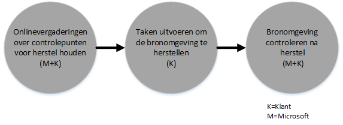
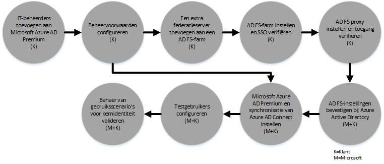

# FastTrack Center Benefit Process voor Azure Rights Management
Als uw organisatie in aanmerking komt voor de FastTrack Center Benefit voor Microsoft Azure Rights Management, kunt u op afstand met Microsoft-specialisten werken om uw Azure RMS-omgeving gereed te maken voor gebruik. Zie [FastTrack Center Benefit voor Azure Rights Management](../Topic/FastTrack_Center_Benefit_for_Azure_Rights_Management.md) om te bekijken of uw organisatie in aanmerking komt.

In dit artikel wordt het volgende behandeld:

-   [Overview of the onboarding process](#overview_rms)

-   [Expectations for your source environment](#expectations_src_environ_rms)

-   [Phases of the onboarding process](#phases_onboarding_process_rms)

-   [Microsoft responsibilities](#microsoft_responsibilities_rms) voor elke fase

-   [Your responsibilities](#your_responsibilities_rms) voor elke fase

Dit is wat u kunt verwachten wanneer het voorbereiden is voltooid:

-   Uw Microsoft Azure RMS-tenant is gemaakt.

-   Gelicentieerde gebruikers kunnen toegang krijgen tot Azure RMS-services met een van de volgende identiteitsvormen:

    -   Cloud-identiteiten (unieke Microsoft Azure AD-accounts).

    -   Gesynchroniseerde identiteiten: Microsoft Azure AD-accounts die gesynchroniseerd zijn vanaf de on-premises Active Directory met het Azure Active Directory Connect-hulpprogramma (Azure AD Connect) voor klanten met één Active Directory-forest of meerdere Active Directory-forests.

    -   Federatieve identiteiten met Microsoft Azure AD-accounts die zijn:

        -   Gesynchroniseerd vanaf de Active Directory met het Microsoft Azure AD Connect-hulpprogramma voor klanten met een configuratie voor één Active Directory-forest.

        -   Gefedereerd met Active Directory Federation Services (AD FS) 2.0 of een latere versie vanaf de lokale Active Directory.

## Overzicht van het voorbereidingsproces
Voorbereiding bestaat uit twee hoofdonderdelen:

-   **Belangrijkste mogelijkheden** - Taken die zijn vereist voor tenantconfiguratie en ‑integratie in Azure AD, indien nodig. Deze taken voorzien ook in de basis van de voorbereiding van andere in aanmerking komende services van Microsoft Online.

-   **Servicevoorbereiding** - Taken die zijn vereist voor zelfstandige configuratie van Azure RMS of met Azure AD Connect directory-synchronisatie of AD FS.

In het volgende diagram wordt de planning voor het gebruiken van de FastTrack Center Benefit beschreven.

Het basisproces verloopt als volgt:

-   Microsoft neemt binnen 30 dagen na aankoop van het in aanmerking komende programma contact met u op. U kunt ook om hulp vragen vanuit het [FastTrack Center](http://fasttrack.microsoft.com/) als u klaar bent om deze services te implementeren voor uw organisatie. Als u om hulp wilt vragen, meldt u zich aan bij het FastTrack Center (http://fasttrack.microsoft.com), gaat u naar het dashboard, selecteert u de naam van uw bedrijf, klikt u op het tabblad Aanbiedingen en klikt u op de knop voor ondersteuning aanvragen voor de in aanmerking komende service.

-   Het Microsoft-team helpt u met de belangrijkste mogelijkheden en helpt u daarna met de voorbereidingen voor elke in aanmerking komende service.

Alle voorbereidingsondersteuning wordt op afstand aangeboden door toegewezen medewerkers van Microsoft:

-   Microsoft helpt u op afstand met verschillende voorbereidingsactiviteiten aan de hand van verschillende hulpprogramma’s, documentatie en richtlijnen. Als u wilt dat Microsoft bepaalde configuratietaken voor u uitvoert, kunt u Microsoft bepaalde toegang en machtigingen geven om deze taken uit te voeren.

-   De voorbereidingsondersteuning wordt aangeboden door het FastTrack Center en is beschikbaar tijdens de reguliere kantooruren in elke regio.

-   Voorbereidingsondersteuning is beschikbaar in het Traditioneel Chinees, Engels, Frans, Duits, Italiaans, Japans, Portugees (Brazilië) en Spaans.

-   U kunt aangeven of u of uw vertegenwoordiger gaat samenwerken met het Microsoft-team.

## Verwachtingen voor uw bronomgeving
Mogelijk hebt u al een on-premises Microsoft Active Directory in uw bronomgeving die u wilt integreren met Microsoft Azure Active Directory, zodat uitgebreid identiteitsbeheer mogelijk wordt vanaf één console. De FastTrack Center Benefit bestaat onder andere uit ondersteuning bij het integreren van Microsoft Azure Active Directory met uw bestaande, on-premises implementatie. Als integratie is vereist, moet uw bronomgeving een minimaal niveau hebben voor deze toepassing.

In de volgende tabel wordt weergegeven wat er van uw bestaande bronomgeving wordt verwacht voor het voorbereiden.

|Activiteit|Verwachtingen voor de bronomgeving|
|--------------|--------------------------------------|
|Belangrijkste mogelijkheden|Active Directory-forests met het functionele forestniveau ingesteld op Windows Server 2008 of hoger, met de volgende forestconfiguratie:  -   Eén Active Directory-forest -   Meerdere Active Directory-forests **Note:** AD FS-implementatie voor configuraties met meerdere forests valt niet onder de FastTrack Center Benefit.|
|Voorbereiden op services  -   Azure RMS|De on-premises Active Directory en de omgeving zijn voorbereid voor Azure RMS, wat inhoudt dat geïdentificeerde problemen die de integratie met Azure AD en functies van Azure RMS in de weg kunnen staan, zijn hersteld.|

## Fasen van het voorbereidingsproces
De voorbereiding op Azure RMS heeft vijf hoofdfasen, zoals aangegeven in de onderstaande figuur:

-   Starten

-   Beoordelen

-   Herstellen

-   Inschakelen

-   Sluiten

Voor een gedetailleerd overzicht van de taken tijdens elke fase, raadpleegt u de secties [Microsoft responsibilities](#microsoft_responsibilities_rms) en [Your responsibilities](#your_responsibilities_rms).

### Startfase
Wanneer u het juiste aantal licenties hebt aangeschaft, volgt u de instructies in het aankoopbevestigingsbericht om de licenties te koppelen aan de bestaande of nieuwe tenant. Microsoft controleert of u in aanmerking komt voor de FastTrack Center Benefit. Microsoft neemt binnen 30 dagen na aankoop van het in aanmerking komende programma contact met u op. U kunt ook om hulp vragen vanuit het [FastTrack Center](http://fasttrack.microsoft.com/) als u klaar bent om deze services te implementeren voor uw organisatie. Als u om hulp wilt vragen, meldt u zich aan bij het FastTrack Center (http://fasttrack.microsoft.com), gaat u naar het dashboard, selecteert u de naam van uw bedrijf, klikt u op het tabblad Aanbiedingen en klikt u op de knop voor ondersteuning aanvragen voor de in aanmerking komende service.

Tijdens deze fase bespreken we het voorbereidingsproces, controleren we gegevens en maken we een afspraak voor een startvergadering.

### Beoordelingsfase
Zodra met het voorbereidingsproces wordt gestart, gaat Microsoft met u samenwerken om de bronomgeving en de vereisten te beoordelen. Er worden programma’s gebruikt om uw omgeving te evalueren en Microsoft begeleidt u bij het evalueren van uw lokale Active Directory, internetbrowsers, besturingssystemen op apparaten van klanten, DNS, netwerk, infrastructuur en identiteitssysteem om vast te stellen of er wijzigingen moeten worden aangebracht voordat gestart kan worden met de voorbereiding. We bieden op basis van uw huidige instellingen een herstelplan om ervoor te zorgen dat uw bronomgeving aan de minimale vereisten voldoet voor een succesvolle voorbereiding op Azure RMS. We gaan ook controlepuntgesprekken inplannen voor tijdens de herstelfase.

### Herstelfase
Indien nodig voert u taken uit het herstelplan uit voor de bronomgeving, zodat u voldoet aan de vereisten voor het voorbereiden op elke service.

Voordat met de inschakelfase wordt gestart, controleren we samen de resultaten van de herstelactiviteiten om er zeker van te zijn dat u er klaar voor bent om door te gaan.

### Inschakelfase
Wanneer alle herstelactiviteiten zijn voltooid, wordt verdergegaan met het configureren van de kerninfrastructuur voor het gebruiken van services en voor het inrichten van Azure RMS.

**Inschakelfase - Belangrijkste mogelijkheden**

Het inschakelen van de belangrijkste mogelijkheden omvat het inrichten van services en het integreren van tenants en identiteiten. Dit omvat ook stappen voor het ontwikkelen van een basis voor de voorbereiding op Microsoft Azure RMS.

Het voorbereiden op Azure RMS kan beginnen zodra de belangrijkste voorbereiding is voltooid.

**Inschakelfase – Azure RMS**

De Azure RMS-omgeving kan worden ingesteld met Azure AD Connect directorysynchronisatie en Active Directory Federation Services (AD FS).

Bij gebruik van Azure RMS waarbij on-premises identiteiten met de cloud moeten worden gesynchroniseerd, kunnen wij u helpen met het toevoegen van IT-beheerders en gebruikers aan uw abonnement, configureren van randvoorwaarden voor beheer, instellen van Azure AD Connect, instellen van directorysynchronisatie met Azure AD Connect, instellen Active Directory Federation Services met Azure AD Connect, configureren van testgebruikers en valideren van de belangrijkste gebruiksomstandigheden voor de service.

Met het installeren van Azure RMS worden de volgende functies geactiveerd:

-   RMS-service inschakelen

-   IRM-configuratie voor Exchange Online en Sharepoint Online

-   Rights Management-connector met Exchange on-premises en Sharepoint on-premises

-   De toepassing RMS sharing voor Windows- en niet-Windows-apparaten

## De verantwoordelijkheden van Microsoft

### Algemeen

-   Hulp op afstand bieden voor de vereiste configuratieactiviteiten, zoals beschreven in de gedetailleerde fasebeschrijvingen.

-   Beschikbare documentatie en hulpprogramma's bieden, en daarnaast beheerconsoles en scripts zodat u het aantal configuratietaken kunt verminderen of er geen meer hoeft uit te voeren.

Het is niet vereist om Microsoft toegang en machtigingen te geven om gebruik te maken van de FastTrack Center Benefit. In enkele gevallen kunt u Microsoft bepaalde toegang en machtigingen geven om namens u specifieke activiteiten uit te voeren.

### Startfase

-   Binnen 30 dagen na de aankoop van in aanmerking komende licenties voor een nieuwe tenant contact met u opnemen.

-   Aangeven welke in aanmerking komende services u wilt voorbereiden.

### Beoordelingsfase

-   Een administratief overzicht bieden.

-   Hulp bieden bij:

    -   DNS-, netwerk- en infrastructuurbehoeften.

    -   De clientvereisten (internetbrowser, besturingssysteem en services).

    -   Gebruikers-id en het inrichten.

    -   Identificeren van vereisten voor directorysynchronisatie.

    -   In aanmerking komende services inschakelen die zijn aangeschaft en onderdeel moeten uitmaken van het voorbereidingsproces.

    -   Identificatie van de vereiste vereisten voor testen en de testomgeving.

-   Een planning maken voor de herstelactiviteiten.

-   Een herstelcontrolelijst overdragen.

### Herstelfase

-   Telefonische vergaderingen voeren volgens de overeengekomen planning om de voortgang van de herstelactiviteiten te beoordelen.

-   Hulp bieden bij het uitvoeren van hulpprogramma’s om problemen te identificeren en op te lossen, en bij het interpreteren van de resultaten.

### Inschakelfase
Advies geven over:

-   Uw Azure RMS-tenant activeren.

-   Configuratie firewallpoorten.

-   DNS configureren voor in aanmerking komende services.

-   De verbinding met Azure RMS-services valideren.

-   Voor een omgeving met één forest:

    -   Indien nodig een directorysynchronisatie installeren tussen uw Active Directory Domain Services (AD DS) en Azure AD Connect.

    -   Configureren wachtwoordsynchronisatie met het Azure AD Connect-hulpprogramma.

-   Voor een omgeving met meerdere forests:

    -   Azure AD Connect-synchronisatie installeren en instellen voor scenario’s voor meerdere forests. De functies wachtwoordhashsynchronisatie en wachtwoord terugschrijven worden ondersteund door een omgeving met meerdere forests.  Andere write-backscenario’s worden niet ondersteund.

    -   De synchronisatie tussen on-premises Active Directory-forests en Microsoft Azure AD-directory (Azure Active Directory) configureren.

        > [!NOTE]
        > De ontwikkeling en implementatie van aangepaste regeluitbreidingen zijn niet inbegrepen.

-   Voor één forest wanneer het doel federatieve identiteiten is: indien nodig Active Directory Federation Services (AD FS) installeren en configureren voor de verificatie van lokale domeinen door Microsoft Azure AD, in een configuratie met één locatie en fouttolerantie.

    > [!NOTE]
    > AD FS-implementaties vallen niet binnen het bereik van configuraties met meerdere forests.

-   De functionaliteit van eenmalige aanmelding (SSO) testen, indien deze is geïmplementeerd.

-   Meer beveiligingsadministrators van gegevens toevoegen voor het beheren van sjablonen.

-   Een supergebruikersaccount toewijzen aan Azure RMS.

-   Twee testgebruikers een licentie verlenen voor Azure RMS.

-   Twee testdistributiegroepen configureren om het beleid te valideren.

-   Een aangepaste Azure RMS-sjabloon configureren voor uw directory.

-   Begeleiding voor het instellen van integratie met SharePoint Online en Exchange Online met Azure RMS omvat:

    -   Exchange Online-integratie met Azure RMS configureren en valideren.

    -   Een testregel instellen voor de e-mailstroom om gevoelige berichten te versleutelen die naar ontvangers buiten uw organisatie worden verzonden.

    -   SharePoint Online-beveiliging configureren en valideren voor een testbibliotheek die moet worden beveiligd met Azure RMS.

-   Een server on-premises met de RMS-Connector configureren, indien van toepassing:

    -   On-premises Exchange 2013/2010-integratie met Azure RMS configureren en valideren.

    -   Een testregel instellen voor de e-mailstroom om gevoelige berichten te versleutelen die naar ontvangers buiten uw organisatie worden verzonden met de connector.

    -   On-premises SharePoint 2013/2010-beveiliging configureren en valideren voor een testbibliotheek die moet worden beveiligd met Azure RMS.

-   De toepassing RMS sharing voor Windows- en niet-Windows-apparaten instellen.

## Uw verantwoordelijkheden
In dit gedeelte wordt een aantal van uw verantwoordelijkheden tijdens het voorbereidingsproces beschreven.

### Algemeen

-   Alle verbeteringen en integraties in uw Azure RMS-tenant, afgezien van de configuratieopties die in dit artikel worden vermeld.

-   Algemeen programma- en projectbeheer van uw resources.

-   Communicatie met eindgebruikers, documentatie aanbieden aan eindgebruikers, eindgebruikers trainen en wijzigingsbeheer.

-   Documentatie voor en training van helpdeskmedewerkers.

-   Het opstellen van rapporten, presentaties en notulen van vergaderingen die specifiek zijn voor uw organisatie.

-   Architecturale en technische documentatie opstellen die specifiek is voor uw organisatie.

-   Hardware en netwerken ontwerpen, kopen, installeren en configureren.

-   Software kopen, installeren en configureren.

-   Het beheren, configureren en toepassen van beveiligingsbeleid afgezien van wat is ingesteld voor het testen van uw basislijnconfiguratie en -functionaliteit voor Azure RMS-services.

-   Gebruikersaccounts inschrijven afgezien van deze die zijn gebruikt bij het testen van de basislijnconfiguratie en -functionaliteit voor Azure RMS-services.

-   Het netwerk configureren en analyseren en de bandbreedte valideren, testen en bewaken.

-   Het goedkeuringsproces voor technisch wijzigingsbeheer beheren en ondersteuningsdocumentatie creëren.

-   Uw bedrijfsmodel en bedrijfsrichtlijnen bewerken.

-   Buiten gebruik stellen en verwijderen van bronomgevingen en services die eerder door de klant werden gebruikt.

-   Een testomgeving maken en onderhouden.

-   Servicepacks en andere vereiste updates installeren op de infrastructuurservers.

-   Openbare SSL-certificaten verzorgen en configureren.

-   De voorwaarden van de organisatie die moeten worden geconfigureerd en getoond op de apparaten van eindgebruikers.

### Startfase

-   Samenwerken met het team van Microsoft om de voorbereiding van in aanmerking komende services te starten.

-   Deelnemen aan de startvergadering, deelnemers uit uw organisatie begeleiden en de herstelplanning bevestigen.

### Beoordelingsfase

-   Geschikte belanghebbenden selecteren (waaronder een projectmanager) om de vereiste beoordelingsactiviteiten uit te voeren.

-   Als u wilt, kunt u uw scherm delen met Microsoft wanneer u hulp nodig hebt met het uitvoeren van beoordelingshulpprogramma’s in uw omgeving of voor uw Azure RMS-abonnement.

-   Deelnemen aan de vergaderingen om de herstelcontrolelijst te maken en om bij te dragen aan het algemene plan, waaronder met betrekking tot infrastructuur, netwerk, beheer, voorbereiding op directorysynchronisatie, netwerkbeveiliging en federatieve identiteiten.

-   Deelnemen aan de vergaderingen om een overzicht te creëren van de aanpak van gebruikersinrichting.

-   Deelnemen aan de vergaderingen om de configuratie van Online Services te plannen.

-   Een ondersteuningsplan maken ter voorbereiding op de migratie.

### Herstelfase

-   De vereiste stappen uitvoeren om de herstelactiviteiten te voltooien die zijn geïdentificeerd in de beoordelingsfase.

-   Deelnemen aan de controlepuntvergaderingen.

### Inschakelfase

-   Als u wilt, kunt u uw scherm delen met Microsoft wanneer u hulp nodig hebt met het uitvoeren van wijzigingen in uw omgeving of voor uw Azure RMS-abonnement.

-   Resources op de juiste manier beheren.

-   Netwerkgerelateerde items configureren op basis van de richtlijnen van Microsoft.

-   Ervoor zorgen dat de directory’s gereed zijn en de directorysynchronisatie configureren op basis van de richtlijnen van Microsoft.

-   De beveiligingsgerelateerde infrastructuur configureren (zoals firewallpoorten) op basis van de richtlijnen van Microsoft.

-   De juiste clientinfrastructuur implementeren.

-   Een aanpak voor gebruikersinrichting implementeren op basis van de richtlijnen van Microsoft.

-   Verschillende services inschakelen op basis van de richtlijnen van Microsoft.

## Meer weten?
Zie [Microsoft Azure Rights Management](http://products.office.com/business/microsoft-azure-rights-management) en [Enterprise Mobility Suite](http://www.microsoft.com/en-us/server-cloud/products/enterprise-mobility-suite/default.aspx).

