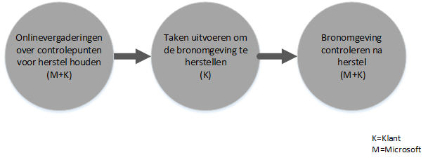

# FastTrack Center Benefit-proces voor Intune
Als uw organisatie in aanmerking komt voor het Microsoft Intune-servicevoordeel, kunt u samenwerken met externe specialisten van Microsoft om uw Microsoft Intune-omgeving klaar te maken voor gebruik.

Microsoft Intune is het deel van de Microsoft Enterprise Mobility Suite (EMS) dat u de mogelijkheden biedt van Enterprise Mobility Management (EMM), met inbegrip van Mobile Device Management (MDM) en Mobile Application Management (MAM).  Met Microsoft Intune stelt u uw werknemers in staat om productief te zijn op mobiele apparaten door apparaten in te richten, apparaten te configureren en mobiele apps te implementeren.  U kunt Microsoft Intune ook gebruiken om u te helpen uw zakelijke gegevens te beschermen, door apparaatcompatibiliteit te bewaken, mobiele toepassingen en gegevens te beveiligen en door integratie in Azure AD om toegang tot zakelijke services te beheren.

Zie [FastTrack Center Benefit voor Intune](../Topic/FastTrack_Center_Benefit_for_Intune.md) voor meer informatie of uw organisatie in aanmerking komt. Zie [FastTrack Center Benefit voor Enterprise Mobility Suite](../Topic/FastTrack_Center_Benefit_for_Enterprise_Mobility_Suite.md) als u geïnteresseerd bent in het voorbereiden van uw omgeving voor andere Enterprise Mobility Suite-services.

**Zoekt u informatie over Microsoft FastTrack voor Office 365? Zie** [FastTrack Center Benefit voor Office 365](https://technet.microsoft.com/library/office-365-onboarding-benefit.aspx).

In dit artikel wordt de volgende informatie over het servicevoordeel voor Microsoft Intune gegeven:

-   [Overview of the onboarding process](#overview_onboarding_process)

-   [Expectations for your source environment](#expectations_src_environ)

-   [Phases of the onboarding process](#phases_onboarding_process)

-   [Microsoft responsibilities](#microsoft_responsibilities) voor elke fase

-   [Your responsibilities](#your_responsibilities) voor elke fase

Dit is wat u kunt verwachten wanneer het voorbereiden is voltooid:

-   Uw Microsoft Online Service-tenant wordt gemaakt.

-   Gebruikers met een licentie kunnen de Microsoft Intune-service gebruiken via een van de volgende identificatieopties:

    -   Cloudidentiteiten (unieke Microsoft Online Service-accounts).

    -   Gesynchroniseerde identiteiten: Microsoft Intune-accounts die zijn gesynchroniseerd vanaf de lokale Active Directory met Azure Active Directory Connect (synchronisatieservices):

        -   Voor klanten met een omgeving met één Active Directory-forest.

        -   Voor klanten waarbij een topologie met meerdere forests wordt ondersteund in de Active Directory.

-   Federatieve identiteiten--Microsoft Intune-accounts:

    -   Gesynchroniseerd vanaf de lokale Active Directory met het Azure Active Directory Connect-hulpprogramma voor klanten met een configuratie voor een omgeving met één Active Directory-forest of voor klanten met een configuratie voor een enkele Active Directory-forestaccount (ook wel 'logon forest') en een configuratie voor een enkele Active Directory-resource forest.

    -   Gefedereerd met Windows Server 2012 RS Active Directory Federation Services-rol vanaf de lokale Active Directory of gefedereerd met Active Directory Federation Services (AD FS) 2.0 of een hogere versie vanaf de lokale Active Directory.

## Overzicht van het voorbereidingsproces
Voorbereiding bestaat uit twee hoofdonderdelen:

-   **Belangrijkste mogelijkheden** - Taken die zijn vereist voor tenantconfiguratie en ‑integratie in Azure AD, indien nodig. Het onderdeel Belangrijkste mogelijkheden biedt ook de basis voor het voorbereiden van andere in aanmerking komende services.

-   **Voorbereiden op services** - Taken die zijn vereist voor het configureren van Microsoft Intune.

Het volgende overzicht beschrijft de volgorde van gebeurtenissen voor het gebruik van FastTrack Center Benefit.

Het basisproces verloopt als volgt:

-   Het FastTrack Center probeert binnen 30 dagen na aankoop van het in aanmerking komende programma contact met u op te nemen. U kunt ook om hulp vragen aan het [FastTrack Center](http://fasttrack.microsoft.com/) als u er klaar voor bent om deze services te implementeren voor uw organisatie. Als u hulp wilt aanvragen, meldt u zich aan bij het [FastTrack Center](http://fasttrack.microsoft.com/), gaat u naar het dashboard, selecteert u uw bedrijfsnaam, klikt u op het tabblad Aanbiedingen en klikt u op de knop Vragen om hulp om ondersteuning te vragen voor Microsoft Intune, Azure Active Directory Premium of Azure Rights Management Premium.

-   Het FastTrack Center helpt u met de belangrijkste mogelijkheden en helpt u daarna met de voorbereidingen voor elke in aanmerking komende service.

Alle voorbereidingsondersteuning wordt op afstand aangeboden door toegewezen medewerkers van Microsoft:

-   Microsoft helpt u op afstand met verschillende voorbereidingsactiviteiten aan de hand van verschillende hulpprogramma’s, documentatie en richtlijnen.

-   De voorbereidingsondersteuning wordt aangeboden door het FastTrack Center en is beschikbaar tijdens de reguliere kantooruren in elke regio.

-   Voorbereidingsondersteuning is beschikbaar in het Traditioneel Chinees, Engels, Frans, Duits, Italiaans, Japans, Portugees (Brazilië) en Spaans.

-   Het Microsoft-team kan rechtstreeks met u of met uw vertegenwoordiger samenwerken.

## Verwachtingen voor uw bronomgeving
Mogelijk hebt u al services in uw bronomgeving die u wilt verplaatsen naar of integreren met de Microsoft Intune-service. Als u gebruik kunt maken van het FastTrack Center Benefit voor Intune, betekent dat voor sommige services dat u hulp krijgt met het instellen van een bepaald integratieniveau in uw bronomgeving. Als integratie is vereist, moet uw bronomgeving een minimaal niveau hebben voor die toepassing.

In de volgende tabel wordt weergegeven wat er van uw bestaande bronomgeving wordt verwacht voor het voorbereiden.

|Activiteit|Verwachtingen voor de bronomgeving|
|--------------|--------------------------------------|
|Belangrijkste mogelijkheden|Active Directory-forests met het functionele forestniveau ingesteld op Windows Server 2008 of hoger, met de volgende forestconfiguratie:  -   Eén Active Directory-forest -   Meerdere Active Directory-forests **Note:** AD FS-implementatie voor configuraties met meerdere forests valt niet onder de FastTrack Center Benefit.|
|Voorbereiden op services  -   Microsoft Intune -   Microsoft Intune geïntegreerd met System Center Configuration Manager|Voor apparaatbeheer met System Center Configuration Manager 2012 R2 of hoger, verbonden met Microsoft Intune, moeten IT-beheerders de [controlelijst voor beheerders opvolgen: Configuration Manager configureren om mobiele apparaten te beheren met Microsoft Intune](https://technet.microsoft.com/library/jj943763.aspx). **Note:** Het servicevoordeel omvat geen hulp bij het instellen of het upgraden van System Center Configuration Manager naar de minimale vereisten voor Microsoft Intune geïntegreerd met System Center Configuration Manager.|

## Fasen van het voorbereidingsproces
De voorbereiding bestaat uit vier primaire fasen:

-   Starten

-   Beoordelen

-   Herstellen

-   Inschakelen

Voor een gedetailleerd overzicht van de taken tijdens elke fase, raadpleegt u de secties [Microsoft responsibilities](#microsoft_responsibilities) en [Your responsibilities](#your_responsibilities).

### Startfase
Wanneer u het juiste aantal en de juiste typen licenties hebt aangeschaft, volgt u de instructies in het aankoopbevestigingsbericht om de licenties te koppelen aan de bestaande of nieuwe tenant. Het FastTrack Center controleert of u in aanmerking komt voor het servicevoordeel. Microsoft probeert binnen 30 dagen na aankoop van het in aanmerking komende programma contact met u op te nemen. U kunt ook om hulp vragen aan het [FastTrack Center](http://fasttrack.microsoft.com/) als u er klaar voor bent om deze services te implementeren voor uw organisatie. Als u hulp wilt aanvragen, meldt u zich aan bij het [FastTrack Center](http://fasttrack.microsoft.com/), gaat u naar het dashboard, selecteert u uw bedrijfsnaam, klikt u op het tabblad Aanbiedingen en klikt u op de knop Vragen om hulp om ondersteuning te vragen voor Microsoft Intune, Azure Active Directory Premium of Azure Rights Management Premium.

Tijdens deze fase bespreken we het voorbereidingsproces, controleren we gegevens en maken we een afspraak voor een startvergadering.

### Beoordelingsfase
Zodra met het voorbereidingsproces wordt gestart, gaat Microsoft met u samenwerken om de bronomgeving en de vereisten te beoordelen. Er worden hulpprogramma's uitgevoerd om uw omgeving te beoordelen en Microsoft helpt u met het beoordelen van uw internetbrowsers, clientbesturingssystemen, DNS, netwerk, infrastructuur en systeem voor identiteitscontrole om vast te stellen of er wijzigingen moeten worden doorgevoerd vóór het voorbereiden. We bieden op basis van uw huidige instellingen een herstelplan om ervoor te zorgen dat uw bronomgeving aan de minimale vereisten voldoet voor een succesvolle voorbereiding op Microsoft Intune. We gaan ook controlepuntgesprekken inplannen voor tijdens de herstelfase.

### Herstelfase
Indien nodig voert u taken uit het herstelplan uit voor de bronomgeving, zodat u voldoet aan de vereisten voor het voorbereiden op elke service.

Voordat met de inschakelfase wordt gestart, controleren we samen de resultaten van de herstelactiviteiten om er zeker van te zijn dat u er klaar voor bent om door te gaan.

### Inschakelfase
Wanneer alle herstelactiviteiten zijn voltooid, wordt verdergegaan met het configureren van de kerninfrastructuur voor het gebruiken van services en voor het inrichten van Microsoft Intune.

**Inschakelfase - Belangrijkste mogelijkheden**

Het inschakelen van de belangrijkste mogelijkheden omvat het inrichten van services en het integreren van tenants en identiteiten. Dit omvat ook stappen voor het ontwikkelen van een basis voor het voorbereiden op Microsoft Intune.

Het voorbereiden op Microsoft Intune kan beginnen zodra het inschakelen van de belangrijkste mogelijkheden is voltooid.

**Inschakelfase – Microsoft Intune**

Voor Microsoft Intune, en op basis van het mobiele apparaat en Mobile Application Management-behoeften, helpen we u met de voorbereiding, zodat u er klaar voor bent Microsoft Intune te gebruiken om apparaten te beheren. De exacte stappen zijn afhankelijk van uw bronomgeving en kunnen het volgende omvatten:

-   Licentieverlening voor uw eindgebruikers. Indien gewenst, bieden we tevens assistentie bij het activeren van volumelicenties voor uw Microsoft cloud servicetenant.

-   Identiteiten configureren die kunnen worden gebruikt door Microsoft Intune, door gebruik te maken van een on-premises Active Directory of van cloudidentiteiten.

-   Gebruikers toevoegen aan uw Microsoft Intune-abonnement, IT-beheerderrollen definiëren en gebruikers- en apparaatgroepen maken.

-   Op basis van uw beheerbehoeften uw instantie voor beheer van mobiele apparaten configureren:

    -   Stel Microsoft Intune in als uw MDM-instantie als Microsoft Intune de enige MDM-oplossing is of samen met Mobile Device Management voor Office 365 wordt gebruikt.

    -   Als u een bestaande implementatie van System Center Configuration Manager hebt en de beheermogelijkheden wilt uitbreiden met Microsoft Intune, kunt u de Configuration Manager instellen als uw MDM-instantie.

        > [!NOTE]
        > Als u Mobile Application Management alleen wilt gebruiken voor de eigen apparaten van uw eindgebruikers, gedeelde apparaten of kioskapparaten, is het instellen van een MDM-instantie niet vereist.

-   Als Mobile Device Management binnen uw bereik valt, bieden we hulp bij:

    -   Testgroepen configureren die moeten worden gebruikt om MDM-beheerbeleid te valideren.

    -   MDM-beheerbeleid en services configureren, zoals:

        -   Toepassingsimplementatie voor elk ondersteund platform, via webkoppelingen of dieptekoppelingen.

        -   Beleid voor voorwaardelijke toegang.

        -   Implementatie van e-mailprofielen.

        -   Instellen van de Microsoft Intune Exchange Connector, indien van toepassing.

    -   Registreren van maximaal twee testapparaten voor elk [ondersteund platform](https://technet.microsoft.com/library/dn600287.aspx) bij uw Microsoft Intune of Configuration Manager met Microsoft Intune-service.

    -   Software- en hardware-inventarisrapporten gebruiken.

-   Als Mobile Application Management (MAM) binnen uw bereik valt, of als u uw bestaande MDM-oplossingen van Microsoft of derden wilt aanvullen met MAM-beleid, bieden we hulp bij:

    -   MAM-beleid voor elk ondersteund platform configureren.

    -   Beleid voor voorwaardelijke toegang configureren voor beheerde apps.

    -   Uw beleid instellen voor de juiste gebruikersgroepen met de bovenstaande MAM-beleidsregels.

    -   Beheerde toepassingen gebruiken voor gebruiksrapporten.

-   Als pc-beheer binnen uw bereik valt, bieden we hulp bij:

    -   De Intune-clientsoftware installeren, indien nodig.

    -   De software -en hardwarerapporten gebruiken die beschikbaar zijn in Intune.

## De verantwoordelijkheden van Microsoft
In dit gedeelte wordt een aantal van de verantwoordelijkheden van Microsoft tijdens het voorbereidingsproces beschreven.

### Algemeen

-   Hulp op afstand bieden voor de vereiste configuratieactiviteiten, zoals beschreven in de gedetailleerde fasebeschrijvingen.

-   Beschikbare documentatie en hulpprogramma's bieden, en daarnaast beheerconsoles en scripts zodat u het aantal configuratietaken kunt verminderen of er geen meer hoeft uit te voeren.

### Startfase

-   Binnen 30 dagen na de aankoop van in aanmerking komende licenties voor een nieuwe tenant contact met u opnemen.

-   Met u samenwerken aan het voorbereidingsproces.

-   Aangeven welke in aanmerking komende services u wilt voorbereiden.

### Beoordelingsfase

-   Een administratief overzicht bieden.

-   Advies geven over:

    -   DNS-, netwerk- en infrastructuurbehoeften.

    -   De clientvereisten (internetbrowser, besturingssysteem en services).

    -   Gebruikers-id en het inrichten.

    -   In aanmerking komende services inschakelen die zijn aangeschaft en onderdeel moeten uitmaken van het voorbereidingsproces.

-   Een planning maken voor de herstelactiviteiten.

-   Een herstelcontrolelijst overdragen.

### Herstelfase

-   Telefonische vergaderingen voeren volgens de overeengekomen planning om de voortgang van de herstelactiviteiten te beoordelen.

-   Hulp bieden bij het uitvoeren van hulpprogramma’s om problemen te identificeren en op te lossen, en bij het interpreteren van de resultaten.

### Inschakelfase
Advies geven over:

-   Het activeren van uw Microsoft Online Service-tenant.

-   TCP/IP-protocollen en firewallpoorten configureren.

-   DNS configureren voor in aanmerking komende services.

-   De verbinding met Microsoft Online Services valideren.

-   Voor een omgeving met één forest:

    -   Indien nodig een directorysynchronisatieserver installeren tussen uw Active Directory Domain Services (AD DS) en de in aanmerking komende Microsoft Online Service(s).

    -   Wachtwoordsynchronisatie (wachtwoordhash) configureren voor Microsoft Intune (Azure Active Directory) met het hulpprogramma Azure Active Directory Connect.

        > [!NOTE]
        > De ontwikkeling en implementatie van aangepaste regeluitbreidingen zijn niet inbegrepen.

-   Voor één forest wanneer het doel federatieve identiteiten is: Indien nodig Active Directory Federation Services (AD FS) installeren en configureren voor de verificatie van lokale domeinen door Microsoft Intune, in een configuratie met één locatie en fouttolerantie.

    > [!NOTE]
    > AD FS-implementaties vallen niet binnen het bereik van configuraties met meerdere forests.

-   De functionaliteit van eenmalige aanmelding (SSO) testen, indien dit is geïmplementeerd.

#### Inschakelfase – Microsoft Intune
Hulp bieden bij:

-   Licentieverlening voor uw eindgebruikers. Indien gewenst, bieden we tevens assistentie bij het activeren van volumelicenties voor uw Microsoft cloud servicetenant.

-   Identiteiten configureren die kunnen worden gebruikt door Microsoft Intune, door gebruik te maken van een on-premises Active Directory of van cloudidentiteiten.

-   Gebruikers toevoegen aan uw Microsoft Intune-abonnement, IT-beheerderrollen definiëren en gebruikers- en apparaatgroepen maken.

-   Op basis van uw beheerbehoeften uw instantie voor beheer van mobiele apparaten configureren:

    -   Stel Microsoft Intune in als uw MDM-instantie als Microsoft Intune de enige MDM-oplossing is of samen met Mobile Device Management voor Office 365 wordt gebruikt.

    -   Als u een bestaande implementatie van System Center Configuration Manager hebt en de beheermogelijkheden wilt uitbreiden met Microsoft Intune, kunt u de Configuration Manager instellen als uw MDM-instantie.

        > [!NOTE]
        > Als u Mobile Application Management alleen wilt gebruiken voor de eigen apparaten van uw eindgebruikers, gedeelde apparaten of kioskapparaten, is het instellen van een MDM-instantie niet vereist.

-   Als Mobile Device Management binnen uw bereik valt, bieden we hulp bij:

    -   Testgroepen configureren die moeten worden gebruikt om MDM-beheerbeleid te valideren.

    -   MDM-beheerbeleid en services configureren, zoals:

        -   Toepassingsimplementatie voor elk ondersteund platform, via webkoppelingen of dieptekoppelingen.

        -   Beleid voor voorwaardelijke toegang.

        -   Implementatie van e-mailprofielen.

        -   Instellen van de Microsoft Intune Exchange Connector, indien van toepassing.

    -   Registreren van maximaal twee testapparaten voor elk ondersteund platform bij uw Microsoft Intune of Configuration Manager met Microsoft Intune-service.

    -   Hardware- en software-inventarisrapporten gebruiken.

-   Als Mobile Application Management (MAM) binnen uw bereik valt, of als u uw bestaande MDM-oplossingen van derden wilt aanvullen met MAM-beleid, bieden we hulp bij:

    -   MAM-beleid voor elk ondersteund platform configureren.

    -   Beleid voor voorwaardelijke toegang configureren voor beheerde apps.

    -   Uw beleid instellen voor de juiste gebruikersgroepen met de bovenstaande MAM-beleidsregels.

    -   Beheerde toepassingen gebruiken voor gebruiksrapporten.

-   Als pc-beheer binnen uw bereik valt, bieden we hulp bij:

    -   De Intune-clientsoftware installeren, indien nodig.

    -   De software -en hardwarerapporten gebruiken die beschikbaar zijn in Intune.

## Uw verantwoordelijkheden
In dit gedeelte wordt een aantal van uw verantwoordelijkheden tijdens het voorbereidingsproces beschreven.

### Algemeen

-   Alle verbeteringen en integraties in uw Microsoft Online Service-tenant, afgezien van de configureerbare opties die in dit artikel worden vermeld.

-   Algemeen programma- en projectbeheer van uw resources.

-   Communicatie met eindgebruikers, documentatie aanbieden aan eindgebruikers, eindgebruikers trainen en wijzigingsbeheer.

-   Documentatie voor en training van helpdeskmedewerkers.

-   Het opstellen van rapporten, presentaties en notulen van vergaderingen die specifiek zijn voor uw organisatie.

-   Architecturale en technische documentatie opstellen die specifiek is voor uw organisatie.

-   Hardware en netwerken ontwerpen, kopen, installeren en configureren.

-   Software kopen, installeren en configureren.

-   De clientsoftware die is vereist voor Microsoft Intune configureren, verpakken en distribueren.

-   Mobiele apparaten activeren.

-   Het netwerk configureren en analyseren en de bandbreedte valideren, testen en bewaken.

-   Het goedkeuringsproces voor technisch wijzigingsbeheer beheren en ondersteuningsdocumentatie creëren.

-   Groepsbeleid opstellen en definiëren per gebruiker en werkstation en voor serverbeheer.

-   Uw bedrijfsmodel en bedrijfsrichtlijnen bewerken.

-   Multi-Factor Authentication instellen.

-   Bronomgevingen buiten bedrijf stellen en verwijderen (zoals andere pc- of apparaatbeheeroplossingen).

-   Een testomgeving maken en onderhouden.

-   Servicepacks en andere vereiste updates installeren op de infrastructuurservers.

-   Openbare SSL-certificaten verzorgen en configureren.

-   De gebruiksvoorwaarden van de organisatie opstellen; deze worden geconfigureerd en weergegeven in de Microsoft Intune-bedrijfsportal die eindgebruikers kunnen openen.

### Startfase

-   Samenwerken met het team van Microsoft om de voorbereiding van in aanmerking komende services te starten.

-   Deelnemen aan de startvergadering, deelnemers uit uw organisatie begeleiden en de herstelplanning bevestigen.

### Beoordelingsfase

-   Geschikte belanghebbenden selecteren (waaronder een projectmanager) om de vereiste beoordelingsactiviteiten uit te voeren.

-   Als u wilt, kunt u uw scherm delen met Microsoft wanneer u hulp nodig hebt met het uitvoeren van beoordelingshulpprogramma’s in uw omgeving of voor uw Microsoft Intune-abonnement.

-   Deelnemen aan de vergaderingen om de herstelcontrolelijst te maken en om bij te dragen aan het algemene plan, waaronder met betrekking tot infrastructuur, netwerk, beheer, voorbereiding op directorysynchronisatie, netwerkbeveiliging en federatieve identiteiten.

-   Deelnemen aan de vergaderingen om een overzicht te creëren van de aanpak van gebruikersinrichting.

-   Deelnemen aan de vergaderingen om de configuratie van Online Services te plannen.

-   Een ondersteuningsplan maken ter voorbereiding op de migratie.

### Herstelfase

-   De vereiste stappen uitvoeren om de herstelactiviteiten te voltooien die zijn geïdentificeerd in de beoordelingsfase.

-   Deelnemen aan de controlepuntvergaderingen.

### Inschakelfase

-   Als u wilt, kunt u uw scherm delen met Microsoft wanneer u hulp nodig hebt met het doorvoeren van wijzigingen aan uw omgeving of uw Microsoft Online Service-abonnement.

-   Resources op de juiste manier beheren.

-   Netwerkgerelateerde items configureren op basis van de richtlijnen van Microsoft.

-   Ervoor zorgen dat de directory’s gereed zijn en de directorysynchronisatie configureren op basis van de richtlijnen van Microsoft.

-   De beveiligingsgerelateerde infrastructuur configureren (zoals firewallpoorten) op basis van de richtlijnen van Microsoft.

-   De juiste clientinfrastructuur implementeren.

-   Een aanpak voor gebruikersinrichting implementeren op basis van de richtlijnen van Microsoft.

-   Verschillende services inschakelen op basis van de richtlijnen van Microsoft.

-   Met Microsoft samenwerken om het voorbereiden op alle in aanmerking komende services binnen 12 maanden na de start van het voorbereiden te voltooien.

-   Wanneer u het beheer van pc’s of mobiele apparaten verzorgt met Microsoft Intune, gebruikt u testapparaten wanneer u via Microsoft Intune nieuw beheerbeleid inschakelt. Als er geen testapparaten beschikbaar zijn, zijn klanten zelf verantwoordelijk voor het maken van back-ups en, indien nodig, voor het herstellen van alle inhoud van de apparaten die tijdens de Microsoft Intune-inschakelfase zijn gebruikt.

-   Maximaal twee toepassingen selecteren voor elk platform dat wordt ondersteund door Microsoft Intune om die vervolgens te implementeren via webkoppelingen of dieptekoppelingen.

-   Beveiligingsbeleid beheren, configureren en toepassen, buiten het beleid dat wordt gebruikt om de basislijnconfiguratie en functionaliteit van de Microsoft Intune-services te testen.

## Meer weten?
Zie [Microsoft Intune](http://www.microsoft.com/en-us/server-cloud/products/microsoft-intune/default.aspx) en [Enterprise Mobility Suite](http://www.microsoft.com/en-us/server-cloud/products/enterprise-mobility-suite/default.aspx).

